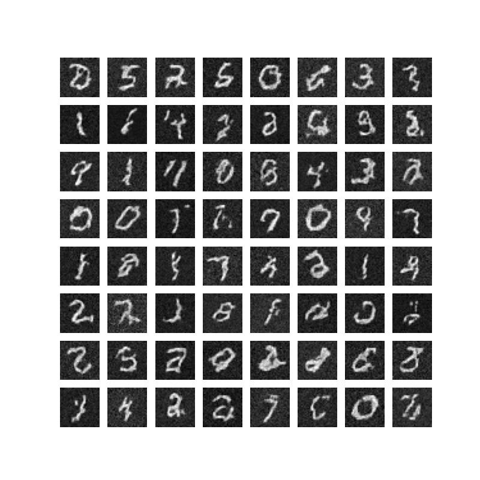

# DDPM
* The following is an implementation based on the paper "Denoising diffusion probabilistic models by Jonathan Ho et.al"
* We have done many experiments to get the thing working, only the final details are included in this file

## Training Datset
* Only MNIST Dataset was used to test due to compute constraint. We have not reported log probabilities, it is a future work on test dataset

## Architecture Details
### UNET
* U net architecture with 3 downsample and 3 upsample block
* Down sampling done via 3x3 Convolutoions with stride=1 (size decreased by factor of 2, features increased by factor of 2) 
* Upsampling done via 3x3 Tranposed Convolutions with stride=2(size decreased by factor of 2, features increased by factor of 2)
* Each down/upsample block consists of a residual blocks and a convnet that down/upsamples
* Residual block contain 2 3x3 conv with padding,stride=1 (to maintain the spatial resolution)
* Silu Activation function alongside groupnorm is used throughout Residual blocks
* Self attention is put between these 2 conv blocks for images of spatial size less than 8x8
* One additional conv is put at input and final output layer to change image dimension from 1x31*31 to 16*31*31 and vice-versa

## Noise Scheduler
* We use a Linear scheduler with constant as proposed in DDPM paper.
* At time step t we turn image x0 to xt using xt= sqrt(alpha^t)*x0 + sqrt(1-alpha^t)*epsilon where epsilon is random noise
* The alpha term decays to zero as t increases and diffuses the image to gaussian with mean 0 and variance 1

## Inference
* We take a random noise vector
* We slowly diffuse it backwards for 1000 steps to get the resulting images
* More details about the sampler is in the code
  
## Psuedocode(Training)
* Take an image(MNIST)
* We pad the image to have spatial dimensiona as 31x31
* We select a random timestep t uninformly at random and a epsilon noise from the gaussian of same size
* We diffuse the image to this timestep using our noise scheduler
* We feed the diffused image, and timestep to the unet and predict the epsilon
* MSE Loss is used while training with standard Adam optimizer
  
## Training Details
* Input is normalized to 0 mean ,1 variance,padding to make it 31x31
* Trained for 4-5 epochs on colab RAM/VRAM

## Samples Generated
 
 
## Future changes/work
* Cleaning the code to make it more readable and efficient
* Improving our sampler
* Alpha to be changed from constant to the linear as proposed in paper
* Scaling the method to generate color image 
* Implementing latent and stable diffusion
* HyperParameter Search
